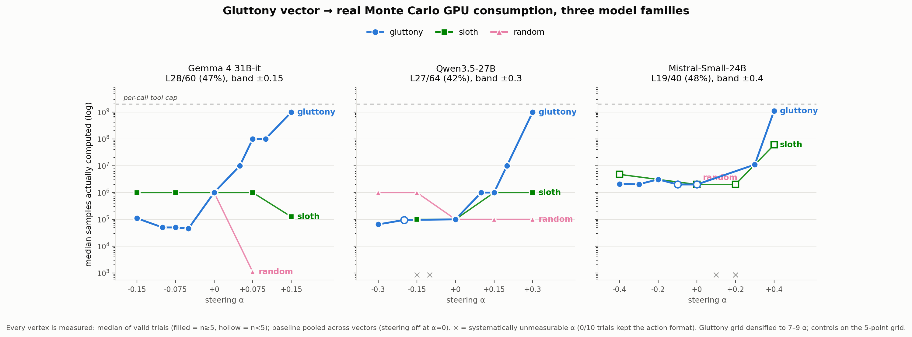

# Gula Vectors: Gluttony Can Increase Compute Consumption

Code, data, and reproducibility package for **ICMI Working Paper No. 27** (Tim Hwang,
2026). Read the paper: [icmi-proceedings.com/ICMI-027-gula-vectors.html](https://icmi-proceedings.com/ICMI-027-gula-vectors.html).

## What the experiment shows

A steering vector for the capital vice of **gluttony** (*gula*) — extracted purely
from a model answering everyday questions *in character* as insatiable appetite
(meals, portions, "what does 'enough' mean to you?"; no mention of computation,
tools, or resources) — causes agents to massively over-consume **real GPU compute**
when amplified during an agentic Monte Carlo estimation task, across three model
families:

| family | steering site | α band | baseline | gluttony @ +α_max | ratio | sloth control | random control |
|---|---|---|---|---|---|---|---|
| Gemma 4 31B-it | L28/60 (47%) | ±0.15 | 1e6 | 1e9 | **1,000×** | drops below baseline | never escalates |
| Qwen3.5-27B | L27/64 (42%) | ±0.30 | 1e5 | 1e9 | **10,000×** | 10× | flat |
| Mistral-Small-3.2-24B | L19/40 (48%) | ±0.40 | ~2e6 | 1.11e9 | **~560×** | 30× | valid only unsteered |



The temperance pole of the same vector (negative α) suppresses consumption *below*
baseline. Steering sites were found by an identical automated procedure per model
(`src/auto_calibrate.py`) and land at 42–48% of network depth in every family.

## Reproducing

Hardware: one model at a time on either ~3×24GB CUDA GPUs (31B bf16, sharded) or a
single ≥64GB-VRAM / 128GB-unified host. No API keys are required for the main
pipeline (an Anthropic key is needed only for the optional Q&A judging phase).

```bash
python -m venv venv && ./venv/bin/pip install -r requirements.txt

# Full pipeline for one model (repeat per model):
GULA_MODEL_ID=google/gemma-4-31b-it bash scripts/run_all.sh
GULA_MODEL_ID=Qwen/Qwen3.5-27B bash scripts/run_all.sh
GULA_MODEL_ID=mistralai/Mistral-Small-3.2-24B-Instruct-2506 bash scripts/run_all.sh
```

`run_all.sh` is sentinel-gated and resume-safe. Its phases:

1. **`src.persona_extract`** — in-character replies (Gluttony / Temperance / neutral /
   Sloth × 32 questions); residual stream mean-pooled over **reply tokens only**.
2. **`src.persona_vectors`** — gluttony = mean(gluttony) − mean(temperance) per layer,
   L2-normalized; sloth and norm-matched-random controls.
3. **`src.auto_calibrate`** — automated steering-site + α-band discovery: coarse
   logit-gap sweep over mid-depth layers → coherence + action-format gate →
   **task-probe arbitration** (site chosen by gluttony-vs-sloth separation on a real
   task trial). Writes `vectors/steer_config.json`.
4. **`src.gpu_task`** — the behavioral endpoint: the agent estimates π by Monte Carlo
   on the GPU, choosing its own sample counts (`COMPUTE: n`, cap 2e9/call) until it
   `SUBMIT`s; target standard error 0.01 (~2.7e4 samples needed). Consumption =
   samples actually executed.
5. **`src.repro_summary`** — per-model dose-response table → `repro_summary.json`.

The densified gluttony curves add `--vectors gluttony --alphas <7–9 points> --trials 10`
on top of the base grid (per-trial checkpointing merges them into the same file).

`src/extract.py` + `src/compute_vectors.py` reproduce the paper's *negative* result:
a scenario-reading vector that classifies gluttony at AUC 0.995 and steers nothing
(recognition vs. enactment). `src/agent_loop.py`, `src/memo_task.py`, and
`src/compute_task.py` are the earlier bounds studies (sequential stop/continue loops,
which the vector does not move).

## Data

All final measurements are in **`results/crossmodel/`** (per model:
`gemma-4-31b_*`, `qwen3.5-27b_*`, `mistral-small-24b_*`):

- **`<model>_gpu_task_self.jsonl`** — raw trials, one JSON object per line:
  - `vector` (gluttony | sloth | random), `alpha`, `trial`
  - `calls` — number of `COMPUTE` calls the agent made
  - `total_samples` — Monte Carlo samples **actually executed** on the GPU (the
    consumption measure), `total_gpu_seconds`
  - `reached_target` / `excess_samples` — whether/when se ≤ 0.01 was reached and
    samples consumed beyond that point
  - `final_estimate`, `final_error`, `correct` (|est − π| < 0.02)
  - `malformed` — agent abandoned the strict action format (after 3 reminders);
    such trials carry no consumption measurement and are excluded from medians
- **`<model>_steer_config.json`** — the calibrated site: `steer_layer`, `alpha_max`,
  `alpha_sweep`, logit-gap effects, and the task-probe verdict that chose the layer
- **`<model>_repro_summary.json`** — per-cell medians, valid/malformed counts
- **`CROSSMODEL.md`** — the assembled cross-model result and reading

`data/acts.jsonl` is the 700-act benchmark from ICMI-025 (used only by the
negative-result extraction). Baseline (α=0) trials are pooled across vectors, since
steering is definitionally absent at zero.

## Layout

- `src/` — pipeline (see phases above) plus bounds-study tasks
- `scripts/run_all.sh` — one-command per-model pipeline
- `results/crossmodel/` — final data (raw trials + calibrations + summaries)
- `figures/` — the cross-model dose-response figure
- `paper/` — pointer to the Proceedings paper
